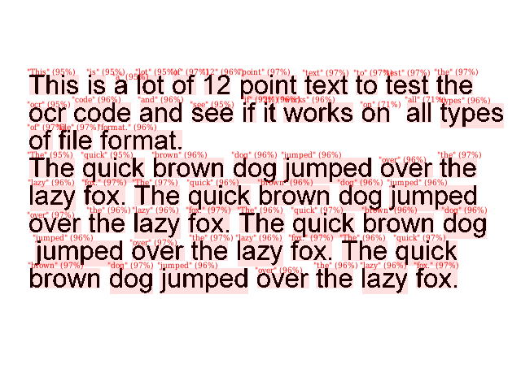
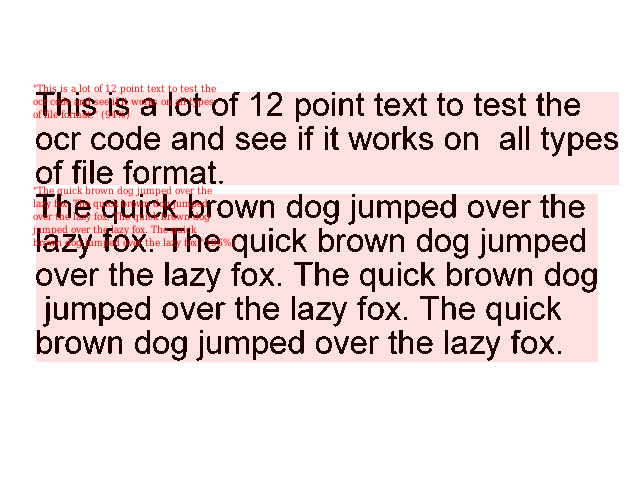
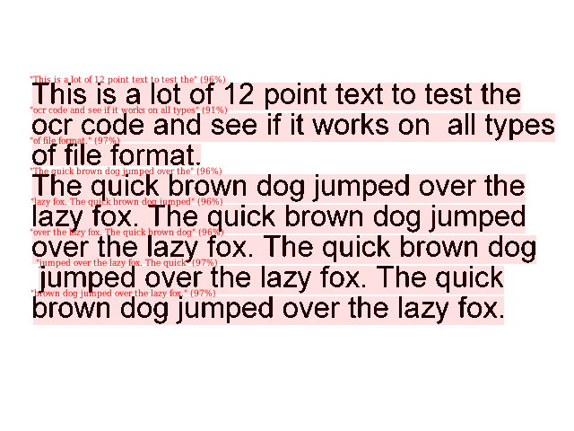
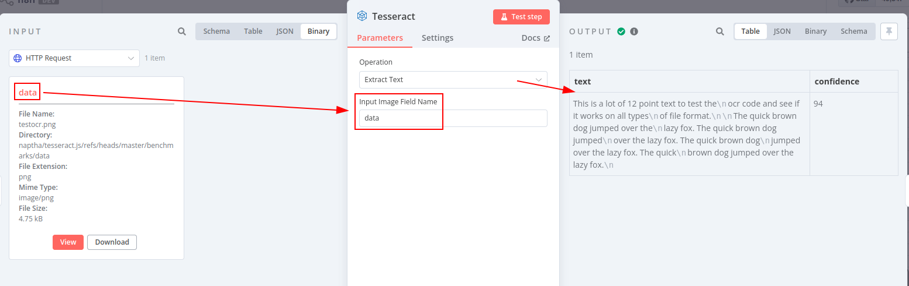
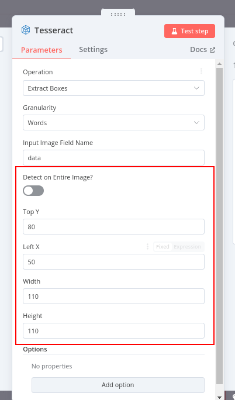
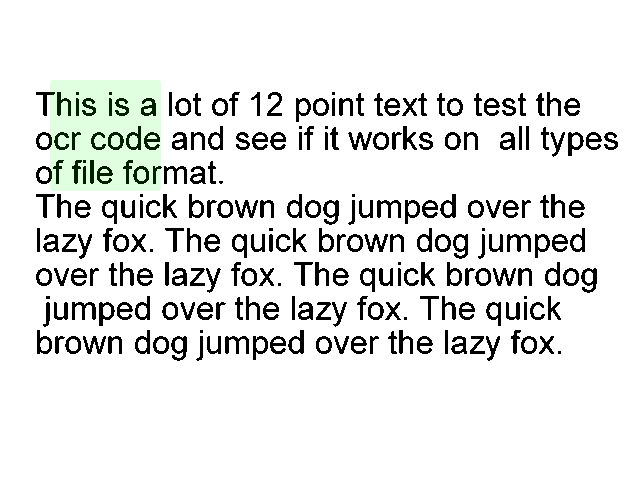
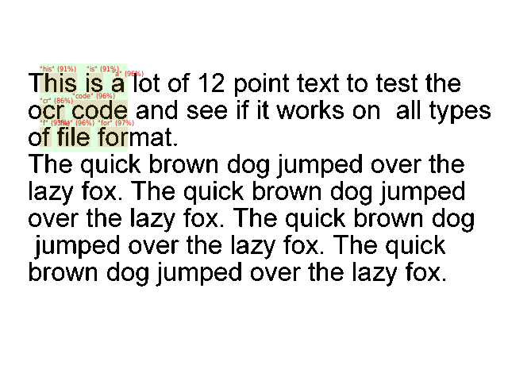
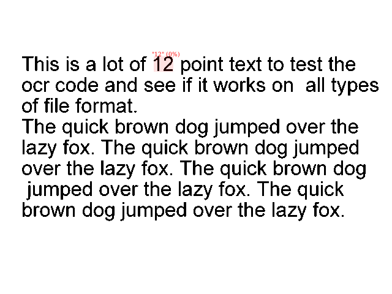
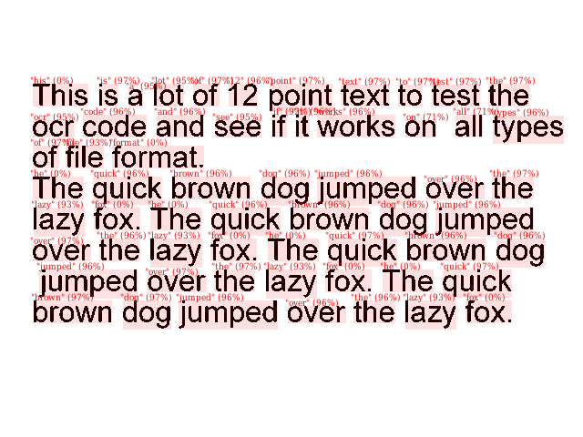

# n8n-nodes-tesseractjs

This is a n8n community node. It lets you use [Tesseract.js](https://tesseract.projectnaptha.com/) in your n8n
workflows.

[Tesseract](https://github.com/tesseract-ocr/tesseract?tab=readme-ov-file#about) is an open source OCR (Optical
Character Recognition) engine that can recognize text (machine/typed/printed text, not handwritten) in images (e.g. PNG
or JPEG) or images embedded in PDF files.

To read text from PDFs directly (not from images), you may want
[the **Extract from PDF** operation of the built-in **Extract from file** node
](https://docs.n8n.io/integrations/builtin/core-nodes/n8n-nodes-base.extractfromfile/#operations)

[n8n](https://n8n.io/) is a [fair-code licensed](https://docs.n8n.io/reference/license/) workflow automation platform.

[Installation](#installation)  
[Operations](#operations)  
[Compatibility](#compatibility)  
[Usage](#usage)  <!-- delete if not using this section -->  
[Resources](#resources)  
[Version history](#version-history)  <!-- delete if not using this section -->

## Installation

Follow the [installation guide](https://docs.n8n.io/integrations/community-nodes/installation/) in the n8n community
nodes documentation.

You can quickly get started by importing [the sample playbook](./sample_workflow.json).

## Operations

Note: both operations will output a new binary field, called `ocr`, which contains the image that was actually OCR'd.
For input images, this will be the same image. For input PDFs, this will be each image in the PDF.

### Extract text

This operation reads the text of the entire image. It outputs a JSON item containing the entire recognized text, and a "
confidence value" indicating how likely the generated text is to match the source image, as a percentage:

```json
{
	"text": "...",
	"confidence": 94
}
```

If passed a PDF instead of an image, the node may output several items, one for each image in the PDF. Each item will
have the format described above.

### Extract boxes

This operation also reads text, but returns more information about the bounding box of each detected block, and the
detected
language if available.

The "granularity" of the detections can be controlled: you can split on paragraphs, lines, words or individual
characters.

```json
{
	"blocks": [
		{
			"text": "This",
			"confidence": 95.15690612792969,
			"bbox": {
				"x0": 36,
				"y0": 92,
				"x1": 96,
				"y1": 116
			},
			"language": "eng"
		},
		{
			"text": "is",
			"confidence": 95.15690612792969,
			"bbox": {
				"x0": 109,
				"y0": 92,
				"x1": 129,
				"y1": 116
			},
			"language": "eng"
		},
		...
	]
}
```



Entire paragraphs:



Per-line statistics:



If passed a PDF instead of an image, the node may output several items, one for each image in the PDF. Each item will
have the format described above.

## Compatibility

This node has been tested on n8n v1.68.0, but should also work on older versions. If you encounter an issue with an
older version, please [raise an issue](https://github.com/jreyesr/n8n-nodes-tesseractjs/issues).

## Usage

### Input Image Field Name

All Operations of this node have a field **Input Image Field Name**, where the _name_ of a Binary item should be
provided:



The Binary file with that name will be read and processed. It should be an image or a PDF document. If a PDF, all images
inside the PDF will be extracted and processed separately.

### Detect on Entire Image?

It's possible to limit the OCR to a certain segment of an image, by toggling the **Detect on Entire Image?** switch
to Off. When doing so, it's necessary to provide the top and left coordinates of the desired bounding box, and the width
and height of the box. For example:



This could delineate a region like this:



When performing OCR on that region, it'd only return the text that was contained in that box, even truncating words of
they lie halfway across the bounding box's borders:



### Force Resolution

This option can be used if Tesseract can't autodetect the image's resolution, such as a PNG that doesn't carry that
information.

### Minimum Confidence

Each recognized block of text (the entire image in the Extract Text operation, or a block such as a paragraph, word or
letter in the Extract Boxes operation) has a `confidence` value
that [correlates with the likelihood of the recognized text being correct](https://groups.google.com/g/tesseract-ocr/c/SN8L0IA_0D4/m/sFG8cvitAQAJ).
Lower confidences are more likely to contain wrong characters or be junk (such as the OCR engine "recognizing" text in
an image that has none).

> In my experience values below 95 are usually unusable. Above 99 is usually correct. I would set the threshold somewhere between 97.5 and 98.5 depending on your requirements.
> 
> The lowest value I have ever seen is 75 but anything below 90 is extremely rare, even below 95 is rare.

Set the Minimum Confidence option to filter low-confidence results. Ony results that have a confidence _greater than or
equal to_ this value will be returned. By default, or if not provided, it'll be 0, meaning that no filtering will be
performed (because confidence is an integer between 0 and 100, so all confidences are greater than or equal to zero).

### Timeout

If you'd like to abort OCR when a certain image takes too long to process, set the Timeout option (in milliseconds).

Any items that take longer than that time to process will be interrupted and raise an error.
Set [On Error](https://community.n8n.io/t/issue-with-continue-using-error-output-never-any-output/57194) on the node's
Settings if you want execution to continue.

Items that time out will have the `error` or `timeout` key set in the JSON output, so they can be extracted later if
desired. Items that have a `confidence` were successfully processed.

### Controlling which characters can and can't be recognized

If you know that the source image can only have certain characters (e.g. license plates that can only have uppercase
letters, numbers or a dash) or can't have certain characters (e.g. if Tesseract is inserting question marks when there
aren't any), you can explicitly specify which characters will be allowed or which characters will be ignored.

For example, when only the digits 0-9 are allowed, and splitting on words:



Or, when disallowing all uppercase characters:



## Resources

* [n8n community nodes documentation](https://docs.n8n.io/integrations/community-nodes/)
* [Tesseract.js's docs](https://github.com/naptha/tesseract.js/tree/master/docs)

## Version history

### v1.0.0

Initial version, contains the **Extract text** and **Extract boxes** operations.

### v1.0.1

* Fix the installation on N8N instances from NPM
* Add the toggle switch for specifying a bounding box

### v1.1.0

* Add the ability to control the Tesseract PSM (block, column, single line, single word, sparse text)
* Add a setting to override the detected DPI of the image
* Add the ability to specify the whitelist and blacklist

### v1.2.0

* Update the Tesseract.JS version to v6.0.0. No user-facing changes.
	Please [report any issues that you find](https://github.com/jreyesr/n8n-nodes-tesseractjs/issues)!

### v1.3.0

* Add a Timeout option to control the max processing time
	(closes [#3](https://github.com/jreyesr/n8n-nodes-tesseractjs/issues/3))

### v1.4.0

* Add the ability to extract all images from a PDF and process them, in addition to single images
	(closes [#4](https://github.com/jreyesr/n8n-nodes-tesseractjs/issues/4))

### v1.4.1

* Add proper handling for images that are repeated across pages (e.g. logo on header, page background,
	image that was copy-pasted on several pages), which are stored separately from page-specific images

### v1.4.2

* Add options to resize the images before OCR and to not return binary data (solves Invalid string length error on large
	images)

### v1.5.0

* Add option to filter low confidence results (closes [#4](https://github.com/jreyesr/n8n-nodes-tesseractjs/issues/4))
* Downgrade `pdfjs-dist` to v5.3.31 to match N8N's own copy, because otherwise this node conflicted with the Extract
	From File node (closes [#5](https://github.com/jreyesr/n8n-nodes-tesseractjs/issues/5))

## Developer info

```bash
npm i
```

To add this node to a local N8N install:

```shell
npm link
npm run dev # or npm build the first time or when adding assets, such as the node's logo

# in ~/.n8n/custom
npm link n8n-nodes-tesseractjs
```

### Releasing changes

1. Bump the version in package.json. We use SemVer.
2. Add an entry on the [Version History](#version-history) section above describing the changes.
3. Push changes, open a PR and merge it to master branch (if developing on another branch)
4. Create a release. This will kick off the CI which will build and publish the package on NPM
